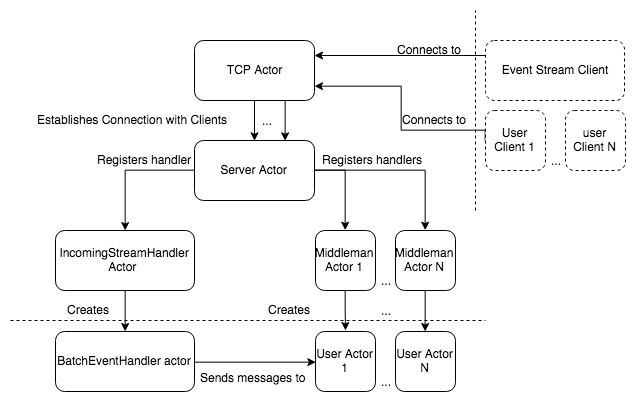

### Introduction:  
 
The application is made using Scala 2.12, using mainly akka components (akka-actors)

### Running the application:  
- Navigate to the root of the project  
- Run `sbt run` or `sbt reStart`. Or after openning sbt in the root directory, use `run` or `reStart` 
- The server starts listenning on the specified ports `9090` and `9099` for clients. 
- After receiving and processing all the messages, the Server terminates the clients and the user actors, and is ready to accept new connections.

### Testing:   
- Simply running `sbt test` will run all the designated unit tests

### Diagrams:

### Details:  
- TCP Layer establishes the connection and creates and registers handlers once the eventStream and user clients are connected and identified.
- Handlers Layer consists of eventBatch handler, which will handle each batch of events, and will approperiately send the approperiate messages to the user actors to process. And user Actors which are mainly responsible for each user, keeping the state of the user (followers, followings..etc) and handles each message designated to the user accordingly.

### Improvements: 
- The task implementation did not address stress testing, or fault tolerance from client side. However this can be something to consider in the future.
- Improved server actor providing back pressure, and buffering against the event stream client.
- Improved dead-letter handling. Since the current implementation assumes user actors by the message, it does not check whether or not these users exist.

### Misc: 
I noticed some problems and artifacts with the clients if running with configurations to send more than 10M events. corrupted messages start to appear and random `\n` within a message also start to appear.
